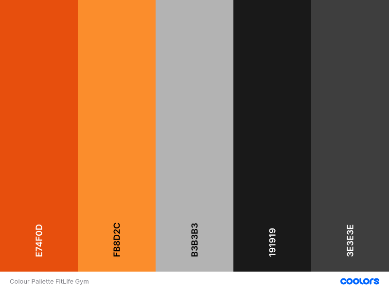

---
## Content
* [UX](#ux)
    * [Site Owner Goal](#owner-goal)
    * [User Goals](#user-goal)
    * [User Stories](#user-stories)
    * [User Requirements](#user-req)
    * [User Expectations](#user-exp)
    * [Design Choices](#design-choices)
    * [Wireframes](#wireframes)

* [Features](#features)
    * [Existing Features](#fea-now)
    * [Future Features](#fea-future)

* [Technologies used](#tech-used)
    * [Languages](#lang)
    * [Tools and Libraries](#lib-and-tools)

* [Testing](#testing)
* [Deployment](#deploy)
* [Credits](#credits)

# UX

## Site Owner Goal 

* Getting users to sign up to the FitLife gym.
* Getting users excited for exercising at the FitLife gym.
* Informing users to the options of exercise at the FitLife gym.
* Informing users to the importances of exercise. Preferably at the FitLife gym.
* Showing users how it is like to exercise at the FitLife gym.

---

## User Goals
* A website where you can learn about the FitLife gym.
* A website where you can sign-up for a subscription at FitLife gym.
* Content to understand why exercise is good. Especially at FitLife gym.
* Lots of positive reinforcement via visual aides:
    * Positive reviews.
    * Example pictures of FitLife people exercising.
    * Example of the things you can do at the FitLife gym.
* A website that is easy to use on all screen sizes.
* A website to contact the FitLife gym.

---

## User Stories

* As a user, I want a website which is easy and intuitively to use.
* As a user, I want to see what the website is about at first glance.
* As a user, I want a website that works on all screen sizes.
* As a user, I want to subscribe to the FitLife gym.
* As a user, I want to see what other people think about the FitLife gym.
* As a user, I want to know what I can do at the FitLife gym.
* As a user, I want to see what people have done and accompliced at the FitLife gym.
* As a user, I want to find the contact details of the FitLife gym.
* As a user, I want to know why I should join the FitLife gym.
* As a user, I want to see the prices of the different subscriptions to the FitLife gym.
* As a user, I want to see relevant social media links of the FitLife gym.

---

## User Requirements

* Easy navigation to sign-up to the gym.
* Information about the gym.
* Contact information for the gym.
* Information about the different subscriptions.
* Visual content about the gym.

---

## User Expectations

* User expects the navigation on the site to be working properly.
* User expects the sign-up form will be submitted correctly.
* User expects the links to the social media to be working properly and open in a seperate browser.
* User expects to find the contact information.

---

## Design Choices

The goal of this site is the entice people to register on this site to become a member at the FitLife gym. Therefore the user should have the basic information at a glance and the colours should be of a positive 'feeling'.

### The structure

For the structure of the website I will use the framework <a href="https://getbootstrap.com/" rel="nofollow" target="_blank" title="link to bootstrap">Bootstrap</a>. This framework allows for a proper responsive website which is build up from a mobile-first perspective. The grid-system that Bootstrap provides is very usefull to have a well working responsive website. Furthermore Bootstrap has a wide browser compatibility, quite easy to use and very customizable.

### Fonts

As the site is intended to inform the user quickly and efficiently about the FitLife gym, the font has to be easy to read and not diverting attention to much from the goal of the user subscribing to the gym. Therefore a simple but well readable font is necessary. I will be using a font from <a href="https://fonts.google.com/" rel="nofollow">Google Fonts</a>, specifically the <a href="https://fonts.google.com/specimen/Ubuntu">Ubuntu Font</a>. As it is a nice to the eyes and good to read. While still looking professional.

### Icons

Several icons will be needed, partially to make the user experience on the mobile phone more fluently and partially because it is the norm to represent links to social media such as facebook and twitter by their logo. I will be using <a href="https://fontawesome.com/" rel="nofollow">Font Awesome</a> for this, as Font Awesome provides all the necessary icons and more.

### Colours

The colours should be positive, helping the site owners goal of getting as many subscriptions to the FitLife gym as possible. However it should also not be too distraction from the information given. Therefore a positive colous pallete is needed, but still pragmatical; not distraction. On the basis of the chosen hero image and the website <a href="https://coolors.co/" rel="nofollow">Coolors.co</a> I have arrived at the following colour pallette: <a href="https://coolors.co/e74f0d-fb8d2c-b3b3b3-191919-3e3e3e">Link to pallette</a>.

* #B3B3B3 "Silver Chalice" Will be the background colour. Its neutral and all other colours will be distinctable.
* #E74F0D "Flame Orange" Will be used for what needs the attention of the user. Such as the sign-up buttons or subscribtion prices.
* #191919 "Eerie Black" Will be used as the primary colour for the text.
* #3E3E3E "Onyx" Will be used as the secondary colour, possible for text if the primary colour will not fit or border just the make a distinction between different elements.
* #FB8D2C "Cadmium Orange" Will be used where the other colours cannot be used. Ie if the Flame Orange is already being used nearby, but the element needs to stand appart.

#### Coolors Contrast Checker

Text versus background contrast is very important. Therefore I have used the <a href="https://coolors.co/contrast-checker/" rel="nofollow" target="_blank">contrast checker</a> on Coolors.
The most important result is the basic background versus the text colour, which scored an <a href="https://coolors.co/contrast-checker/191919-b3b3b3" rel="nofollow" target="_blank">8.39</a>.

---

## Wireframes

I have made wireframes for the sizes Mobile, Tablet and Desktop. As per Bootstrap order, from small to large. To make the wireframes I have used the program <a href="https://balsamiq.com/wireframes/">Balsamig Wireframes</a>.

* <a href="/wireframes/mobile-wireframe-index.png" rel="nofollow" target="_blank" title="Wireframe for mobile">Mobile Wireframe</a>
* <a href="/wireframes/tablet-wireframe-index.png" rel="nofollow" target="_blank" title="Wireframe for tablet">Tablet Wireframe</a>
* <a href="/wireframes/desktop-wireframe-index.png" rel="nofollow" target="_blank" title="Wireframe for desktop">Desktop Wireframe</a>

---
---

# Features

## Existing Features

### The Navigation Bar

The navigationbar is a component from <a href="https://getbootstrap.com/" rel="nofollow" target="_blank" title="link to bootstrap">Bootstrap</a>, which I have modified to fit better with the style of the site. It will stay at the top of the website at all time, so that the user can use it to navigate the website at the users descretion. Furthermore is the navigationbar responsive and will show a menu button, with a dropdown menu when clicked, when viewed on a small tablet or mobilephone.

### The Hero Image/Hero Sign-up

The hero image is meant as an eye catcher; it is clear what the site is about. This is combined with a big 'Sign-up' button to get user to sign up to the gym. The image resizes in such a way that there always exercising people in view. The 'Sign-up' button links to furtherdown the website, where you can commit your contact details.

### The About Section

The about section contains 4 reasons why you should exercise, combined with an image of a member exercising. The responsiveness is done with the grid layout from Bootstrap. On the smaller screen sizes all content will be ordered vertically in one column; 2 paragraphs followed by the image and then followed by the other 2 paragraphs. When the screen gets wider, paragraphs 2 and 4 will jump up to set next to paragraphs 1 and 3, with the image sitting in between the two sets of paragraphs, still aligned vertically. When the screen gets even wider, paragraphs 2 and 4 will jump back below paragraphs 1 and 3, but the content will be aligned horizontally. From left the right; paragraphs 1 and 2, then the image and then paragraphs 3 and 4. All content is responsive and will resize accordingly.

### The Review Section

The review section contains 2 reviews of members of the FitLife gym. This is also made responsive with Bootstrap. On the smaller screen sizes, the reviews will be shown below each other. When the screen gets wide enough they will be shown next to each other.

### The Subscription Section

In the subscription section, there are three different 'subscription cards' to indicate the three options of membership; monthly, per season or yearly. There is a small eyecatcher to the yearly subscription card, which blinks. The select button brings you to the sign up section of the page.

### The Sign-up Section

The sign up section also has an eye catching background, to confirm once again that if you do your exercise at the FitLife gym, you will look great. It also contains the sign-up form, where the user can leave their contact information so that the customerservice of the FitLife gym can contact the user with a membership offer they cannot refuse. It requires the users full name, emailaddress and phonenumber plus their preffered subscription term. In current stage the form will submit to a 'correctly submitted form checker' supplied by the <a href="https://codeinstitute.net/" rel="nofollow" target="_blank" title="link to bootstrap">Code Institute</a> in one of the course lessons.

### The Gallery Preview Section

The gallery section contains images of people working out at the FitLife gym. On this page it is meant as a preview, with only a few images. The gallery is responsive to the screen of the user, done with the grid functionality from Bootstrap. On the smaller screen sizes, three images will be shown, all below one another. When the screen size increases, four images will be shown in 2 rows, both containing 2 images. When the screen gets even wider, three images will be shown all in one row. First three, then four and at most five. That depends on the width of the screen. It also contains the preliminary button to the non-existent dedicated gallery page.

### The Contact Section

The contact section contains the location, phonenumber and emailaddress of the FitLife gym.

---

## Future Features

### A dedicated gallery page

As much more could be shown about the FitLife gym, but not to make the homepage too crowded, a dedicated gallery page could be made. This would require a change in the navigation bar and to the button on the gallery section of the homepage.

### A memberpage

As a member of the FitLife gym, the user would like to see what their current subscription is and possibly an option to enroll in one of the groupcourses. This would need to be specific to each user and requires a login in functionality. As this is beyond my current knowledge it cannot be implemented now, but it would be a future feature that should be implemented.

### A function that an email will be send to the subscriber when subscribing

Currently when you submit the form, it will go to a 'correctly submitted form checker' of the code institute. That ofcourse should be sent to an email address or database of the FitLife gym so that the costumerservice can contact the user. Also the user should receive a copy of the submitted details as an email, possibly with an estimate on when they will be contacted.

### A function where the user can completely subscribe to the FitLife gym, without the inbetween of a customerservice

Even better would be that the user can sign-up and complete registration at the FitLife gym on site without the need for contact with the customerservice. This would require payment options, databases, security while doing the payment and probably steps I can not think of as of now. This is also beyond my current knowledge and can therefore not be implemented now. But it would be a must have feature, as it would cut the presure on the customerservice quite a bit and therefore cost.

---
---

# Technologies

## Languages

* <a href="https://en.wikipedia.org/wiki/HTML" rel="nofollow" target="_blank" title="Link to the HTML wikipedia page">HTML</a>
* <a href="https://en.wikipedia.org/wiki/CSS" rel="nofollow" target="_blank" title="Link to the CSS wikipedia page">CSS</a>

## Libraries and Tools

### Libraries & Frameworks

* <a href="https://getbootstrap.com/" rel="nofollow" target="_blank" title="Link to bootstrap">Bootstrap</a>
* <a href="https://fontawesome.com/" rel="nofollow" target="_blank" title="Link to fontawesome">Fontawsome</a>
* <a href="https://fonts.google.com/" rel="nofollow" target="_blank" title="Link to googlefonts">Googlefonts</a>

### Tools

* <a href="https://www.gitpod.io/" rel="nofollow" target="_blank" title="Link to gitpod">Gitpod</a>
* <a href="https://github.com/" rel="nofollow" target="_blank" title="Link to github">Github</a>
* <a href="https://git-scm.com/" rel="nofollow" target="_blank" title="Link to git">Git</a>
* <a href="https://tinypng.com/" rel="nofollow" target="_blank" title="Link to tinypng">Tinypng</a>
* <a href="https://balsamiq.com/wireframes/" rel="nofollow" target="_blank" title="Link to balsamiq wireframes">Balsamiq Wireframes</a>
* <a href="https://www.w3.org/" rel="nofollow" target="_blank" title="Link to W3schools">W3schools</a>
* <a href="https://stackoverflow.com/" rel="nofollow" target="_blank" title="Link to stackoverflow">Stackoverflow Forums</a>
* <a href="https://jigsaw.w3.org/css-validator/" rel="nofollow" target="_blank" title="Link to the w3 css validator">W3C Css-validator</a>
* <a href="https://validator.w3.org/" rel="nofollow" target="_blank" title="Link to w3c markup validator">W3C Markup-validator</a>

# Testing

---

# Deployment

---

# Credits

https://www.healthline.com/nutrition/10-benefits-of-exercise#TOC_TITLE_HDR_2

---